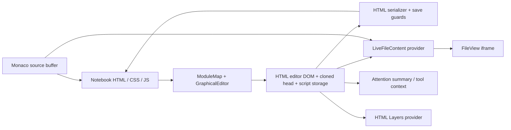

# HTML authoring: Tier 1 architectural investigation

Investigated 2026-09-28 against `c6bcac0` and the existing working tree. This is a reconnaissance report and implementation proposal. No application implementation, framework, dependency, or Notebook content was changed for this investigation.

“Present” below means an inspected implementation exists; it does not imply complete browser validation. “Missing” means no implementation was found in the inspected authoring paths and repository searches. Code-derived defects, architectural inferences, historical measurements, and tests run for this report are distinguished explicitly.

## 1. Executive summary

Nodevision has enough foundation to build these capabilities incrementally. It already has a working HTML editor, reusable panel and tab lifecycles, declarative contextual tool conditions, shared appearance adapters, file references, template insertion, resource acquisition, independent editor histories, live file previews, and an HTML Layers list with virtualization. A replacement web-builder framework would duplicate much of this infrastructure.

The seven requested capabilities depend primarily on four foundations:

1. **An editor-owned document context and transaction boundary.** Extend the existing HTML context with authoritative selection, caret bookmarks, revisions, history, and targeted change notifications. A panel should retain its owning document when its controls take focus.
2. **A CSS source and rule editing layer.** Discover the page's actual stylesheets, retain source locations and conditional-rule ancestry, and explicitly target inline declarations or a selected rule. Properties, Flexbox/Grid, breakpoints, and design variables can share this layer.
3. **Small capability-based Properties and structure providers.** Reuse the existing panel, toolbar-condition, appearance-adapter, and Layers-provider mechanisms. Keep format-specific mutations in the owning editor.
4. **Portable resource relationships.** Build reusable content on ordinary files, existing references, templates, link discovery, and move repair. Decide linked-component semantics separately from detached insertion.

Two blockers should precede substantial feature work:

- **Source fidelity:** the active HTML save path reconstructs the document. It stores top-level scripts as text only, emits them as plain scripts at the end of the body, rebuilds `<html>` without its original attributes, and rebuilds `<body>` with only the tracked style attribute. Thus script `src`/`type`/`defer`, document language, body classes/IDs, and original script position are not generally preserved by that path. These are code-derived findings, not a new end-to-end reproduction. Existing empty-save guards do not establish semantic round-trip fidelity. [H1][H3]
- **Document isolation:** graphical HTML is a `contenteditable` div in the application document, with cloned page head content inserted beside it. Author CSS and application CSS share a document. A narrower editor panel is not an independent CSS media-query viewport. The HTML viewer already uses an iframe and offers a useful starting point for a separate responsive-preview experiment. [H1][V1]

Recommended first deliverable: a tested source-preservation baseline, explicit HTML selection/transaction ownership, and a small Properties panel that can edit one inline declaration and one selected local stylesheet rule with reliable undo. Expand the same path into layout, media queries, and variables. Do not start with seven new panels or a rewrite of every editor.

## 2. Current architecture map

Paths in the evidence links are relative to this report. Function names identify the relevant entry points without relying on unstable line numbers.

| Area | Modules and important entry points | Ownership and consequence |
| --- | --- | --- |
| Format routing | `PanelInstances/ModuleMap.csv`, `ModuleMapLoader.mjs`: `loadModuleMap`, `parseModuleMapCsv` | Cached extension → viewer/editor/family/cursor-provider routing. HTML/HTM use `ViewHTML.mjs` and `HTMLeditor.mjs`; CSS uses `ViewCSS.mjs` and `TextFamilyEditor.mjs`. This is not currently a property-schema registry. [R1] |
| Graphical host | `EditorPanels/GraphicalEditor.mjs`: `setupPanel`, `updateGraphicalEditor`, `activateGraphicalEditorHost`, `cleanupEditorHost` | Resolves modules, stores cleanup per host, activates compatibility globals, registers a live-content provider. Some live-provider ownership remains singleton-based. [G1] |
| HTML implementation | `HTMLeditor.mjs` → `HTMLeditorComponents/HTMLeditorImpl.mjs`: `renderEditor` | Parses with `DOMParser`; mounts editable body, cloned head, hidden script storage; installs table, image, circuit, typography, layout-canvas and save tools. The implementation is 6,368 physical lines; the small entry module has not made its internals modular. [H1] |
| Caret and selection | `registerCaretTracking`, `lastSelectionRangeByEditor`, `restoreEditorSelectionForStyle`, `installHtmlAttentionReporting` | A WeakMap retains ranges per editor, while image/audio/circuit/text/table selections have separate state and global hooks. Attention is a descriptive summary, not a DOM selection owner. [H1][A1] |
| Workspace selection | `NodevisionSelection.mjs`, `NodevisionReference.mjs` | Canonical Notebook file/directory selection and reference identity. Do not overload this with HTML element selection. [N1][N2] |
| HTML Layers | `Common/Layers/htmlLayersContext.mjs`: `createHtmlLayersContext`, `htmlLayerVisibleRange`, `htmlLayerMutationChangesStructure`; `htmlLayerNames.mjs` | Provider owns a private `selectedElement`, a flattened element list, delegated controls, and a filtered MutationObserver. Shared by editor and iframe viewer. [L1][L2] |
| Layers host and SVG comparison | `InfoPanels/SVGLayersPanel.mjs`, `LayerPanelSurface.mjs`, `ElementLayers/panel.mjs`, `ElementLayers/reparent.mjs` | Despite its name, SVGLayersPanel hosts multiple providers. SVG has richer hierarchy, selection and history integration. Its transform-preserving reparent algorithm is SVG-specific. [L3][L4] |
| Viewer and transitions | `FileView.mjs`, `FileViewers/ViewHTML.mjs`, `panelTabContext.mjs`, `workspaceParts/workspaceToolbarActions.mjs` | FileView owns viewer mounting/live content; ViewHTML uses iframe `src` or `srcdoc` with a base URL. Tab activation restores mode and editor hooks. Viewer and graphical editor are different document environments. [V1][V2][P1] |
| CSS and formatting | `readTextStyleSelection`, `applyTextStylesToWysiwygSelection`, font/background helpers; HTML style/font toolbar modules | Computed style is read for selected text, but provenance is not retained. Text formatting primarily changes inline styles/spans. Font tools can create `@font-face` and stylesheet links. [H1][C1] |
| CSS source/view | `CodeEditor.mjs`, `TextFamilyEditor.mjs`, `ViewCSS.mjs`, `cssPreviewSamples.json` | Monaco supports source authoring; the graphical CSS route is a textarea. ViewCSS extracts selector-looking strings with a regex and mounts sample previews plus an unscoped style element. It is not a CSS rule editor/parser. [C2] |
| Directory and application styles | `DirectoryAppearanceCss.mjs`, `DirectoryAppearanceCssColors.mjs`, `DirectoryAppearanceClient.mjs`, `AppStylesPanel.mjs` | Directory appearance already edits selected `:root` custom properties while retaining unrelated CSS. AppStylesPanel manages application presets/UserStyles.css, not the Notebook page's cascade. [C3][C4] |
| Shared appearance/UI | `Common/Appearance/AppearanceModel.mjs`, `AppearancePanel.mjs`, `Controls/HexColorControl.mjs`, `OverlayAppearance.mjs` | Appearance adapter separates reading, preview, commit, cancel, sampling and cleanup. Current concrete integration includes SVG background appearance. Shared controls exist, but many HTML toolbars still duplicate conversion and control code. [U1][U2] |
| Context and tool declarations | `EditorAttentionState.mjs`, `panels/toolbarConditions.mjs`, `contextualToolbarRegistry.mjs`, toolbar JSON | Attention subscriptions and `nv-editor-attention-changed`; `visibleWhen`, `enabledWhen`, `disabledWhen`, legacy conditions; stable subtoolbar identities. `updateToolbarState` still clears/rebuilds the main toolbar. [A1][R2][R3] |
| Commands | `Commands/NodevisionCommandRegistry.mjs`, `CommandDefinitions.mjs`, handler modules | Discoverable commands, metadata and lazy handlers, including editor read/write/save and form insertion. A command invocation is not currently a reversible history entry. [R4] |
| Panels | `panelFactory.mjs`, `panelControls.mjs`, `panelResize.mjs`, `panelDrag.mjs`, `panelTabs.mjs`, `panelContentLifecycle.mjs`, `NodevisionOverlayPanel.mjs` | Existing docked/undocked/overlay presentation, per-tab activation/deactivation/destruction and cleanup. The overlay wrapper already uses the normal panel factory. [P1][P2] |
| Save and live content | HTML context `getHTML`/`save`/`activate`; `saveFile.mjs`, `ShortcutSave.js`, `LiveFileContent.mjs`, server save guards | File/path checks and editor-specific save routing exist. Live providers expose unsaved text to viewers; they do not merge concurrent graphical and Monaco changes. [H3][S1][S2] |
| Templates and Sessions | `Templates/TemplateRegistry.mjs`, `TemplateRenderer.mjs`, `TemplateInsertController.mjs`; `Sessions/SessionUiOwnership.mjs`, `HTMLDraftFocusEditorLock.mjs` | Raw/form templates produce files or insert detached content. Sessions use command and panel APIs and can deliberately own focus/editing constraints; they are not a document component model. [T1][T2] |
| Assets and dependencies | `ResourcePaths/*`, `Resources/ResourceRegistry.mjs`, browser `ResourceAcquisitionService.mjs`, `ResourceReference.mjs` | Typed application/managed/Notebook resources, portable Notebook paths and inline/reference choices. Fonts and assets already have acquisition plumbing. No general linked-HTML-component resolver was found. [D1] |
| References and graph | `utils/notebookPath.mjs`, `GraphManagerDependencies/LinkRecords.mjs`, server `extractHtmlEdges.js`, `linkMove.js`, `linkMoveImpact.mjs` | Source-derived links and move repair already exist, with separate browser/server scanners of different coverage. New component relationships must be discoverable and repairable in all relevant paths. [D2][D3] |
| Performance | `PerformanceDiagnostics.mjs`, `HTMLTypingLatencyDiagnostics.mjs`, HTML Electron benchmark families | Opt-in input-to-paint/mutation probes; native typing, fragmented DOM, app-stack and layout isolation benchmarks. Existing reports are historical and have incomplete scenario matrices. [B1][B2] |

### Current data flow



There is no demonstrated single revisioned document buffer synchronizing all these arrows. `LiveFileContent` chooses a matching provider by timestamp, and its path comparison lowercases names. `GraphicalEditor` can serialize through global HTML hooks and derive dirty state from global `NodevisionState`. These are important two-editor and Linux case-sensitive-path risks, not a proven conflict-resolution mechanism. [G1][S2]

### Save, focus and lifecycle details

`main.mjs` imports the unified save callback and `KeyboardShortcuts/ShortcutSave.js`. The latter installs a document-level Ctrl/Cmd+S handler. HTML also installs a root-level `Control+s` fallback which calls `window.saveWYSIWYGFile(filePath)`. The root handler prevents the default action but does not stop propagation, and the global handler does not check `defaultPrevented`. Thus a single bubbled shortcut can reach both save paths; verify request count and error handling in Electron before adding another shortcut listener. `loadKeyboardShortcuts.mjs` is another configurable mechanism present in the repository, but no active caller was found in the searched application modules. [K1][H1]

HTML context activation restores its path/save hooks and only a small subset of `HTMLWysiwygTools` methods. Rich formatting methods are closures installed during rendering, and `HTMLLayersContext` is assigned separately. Switching between retained HTML tabs therefore needs tests that the selected tool, Layers provider, dirty state and serializer all belong to the same document. The presence of `activate`/cleanup hooks is useful infrastructure, not proof that every singleton tool has been rebound. `EditorSwitchGuard` and `EditorSwitchPrompt` already offer Save/Cancel/Switch Without Saving; extend their document ownership rather than creating a new properties-specific save prompt. [H1][S3]

The server save route includes source/path and HTML payload guards plus backup/trash helpers. These protect particular failure cases; they do not validate retained scripts, stylesheet semantics, or multi-file atomicity. FileView live refresh has its own 350ms debounce after provider notifications; this reduces frequency but can still invoke full serialization/rendering and needs a real neighboring-panel benchmark. [S1][S2][V2]

### Overlap, partial work, and likely legacy paths

- `HTMLeditorComponents/initWYSIWYG.mjs`, `fileLoader.mjs`, and `saveWYSIWYGFile.mjs` target old `#editor`/simplified surfaces. No callers were found from the active `HTMLeditor.mjs` entry path. `SwitchToWYSIWYGediting/*` and standalone WYSIWYG pages are additional legacy implementations. Treat these as reference material until callers are verified, not as feature extension points.
- `formatHtmlMarkup` remains defined in `HTMLeditorImpl.mjs`, but the active serializer does not call it. Do not diagnose current save behavior from this unused formatter.
- HTML text and document style toolbars duplicate color parsing/conversion. `HexColorControl` and the appearance adapter are better generalization candidates than another HTML-only picker.
- `NodevisionSelection`, attention snapshots, native ranges, HTML Layers selection and specialized object selections serve different purposes. Some are complementary; the private element selections need a shared owner.
- Search found few explicit TODOs in the active HTML authoring modules. Missing capability is established by the inspected code paths, not by the presence or absence of TODO comments. A MetaWorld asset route still has a dependency-centralization TODO, while browser link records already parse some MetaWorld resources: another reason not to infer coverage from comments alone.

## 3. Feature-by-feature capability matrix

| Tier 1 area | Existing support | Partial / elsewhere / reusable | Missing behavior | Main blocker | Measurable performance risk |
| --- | --- | --- | --- | --- | --- |
| Properties / Style | Typography, fonts, document backgrounds, tables, image sizing, specialized object tools; arbitrary source edits | SVG Properties, world/circuit inspectors, shared appearance adapter, panel shell | General HTML identity/class/box/layout inspector; explicit source-rule targeting | Multiple selection owners; application/page CSS mixed; no rule provenance | Repeated computed-style reads, activation-driven toolbar rebuilds, hundreds of controls |
| Undo / redo | Native contenteditable undo plus programmatic body snapshots; table hooks | SVG reversible actions, CSV model snapshots, PNG pixel history, Monaco's own stack | One ordered transaction stream covering body/head/CSS and gestures | Native/script histories can diverge; snapshot restore invalidates node/range references | Full `innerHTML` serialization, subtree replacement, rehydration and observer fanout |
| Flexbox / Grid | Authored CSS renders; code/textarea can edit declarations | Shared numeric/select controls and future rule-target adapter | Visual container/item controls and layout-specific readouts | Must distinguish container vs child and authored vs computed values | Measuring every child/track on every pointer event |
| Responsive editing | Resizable panels, zoom, iframe FileView, authored media queries | Viewer viewport and live-content plumbing | Presets/custom CSS viewport; query discovery and scoped edits | Graphical editor has no independent viewport or rule source model | Repeated iframe reloads/full serialization or layout reads while resizing |
| Design variables | CSS custom properties; directory.css appearance edits; font/resource support | Source-range patching patterns, shared controls, CSS source editing | Page-scoped variable catalog, usage/binding controls and grouped UI | Existing appearance values assume a limited concrete-color model; no cascade-aware variable discovery | Recomputing styles or scanning all declarations/elements on each selection |
| Components | Raw/form templates, detached insertion, iframe/resource references, graph and move repair | Circuit references demonstrate file-backed specialized content | General linked HTML instance semantics, update/conflict handling, dependents-aware delete | Portable expansion/runtime choice and source fidelity unresolved | Recursive loading/cycles, repeated expansion and graph rescans |
| HTML Layers | Semantic names; flat document-order list; selection/highlight in list; visibility toggles; virtualized large lists; selected form-script details | Shared host/provider surface; richer SVG tree and selection/history | Full hierarchy, expand/collapse, reorder/reparent, lock, search/filter, robust two-way selection | Provider-private selection; no HTML structural command interface | Whole-root traversal on selection/structural changes despite bounded row DOM |

## 4. Detailed findings and design choices

### 4.1 Properties and Style

The existing HTML text API accepts a small whitelist: color, background color, text stroke color/width, and text shadow. Font tools separately change font-family, generate `@font-face`, and add font stylesheet links. `readTextStyleSelection` reads inline or computed values but does not say which rule supplied the result. Canvas-item resizing sets inline geometry. There is no inspected general identity/class/rule editor for arbitrary HTML elements. [H1][C1]

The proposed UI should be a **normal Properties InfoPanel with reusable section renderers**. Dock, undock and tab behavior should come from the existing panel infrastructure. Use the same appearance section inside an overlay when a focused picker is preferable. Keep the editor context pinned while a Properties control takes focus; changing active workspace selection must not silently retarget an in-progress edit.

Suggested sections and ownership:

| Section | Fields | Mutation owner |
| --- | --- | --- |
| Element | Tag/namespace readout; ID; class tokens; text/content operations where valid | HTML attribute/content commands; ID changes must consider labels, fragments, selectors and script references |
| Size and box | Width/height; min/max; margin; padding; box-sizing | Selected CSS declaration target; preserve units and expressions |
| Layout | Display, position/insets, overflow, z-index; Flexbox/Grid | Same CSS target, with container/item-specific controls |
| Text | Font family/size/weight/style, line-height, spacing, alignment, decoration | Element or retained text-range command, explicitly distinguished |
| Appearance | Color, background, borders/radius, opacity, shadows | CSS adapter to shared appearance controls |

An SVG stroke is not an HTML border, and text stroke is not a box outline. Share value controls and preview/commit/cancel contracts; retain these semantic differences in adapters. The current appearance model supports none/solid/gradient/pattern fills and outline properties, but does not expose CSS-variable binding or mixed-value provenance. Extend its value vocabulary without resolving `var(...)` permanently to a hex color. [U1]

#### Style destination must be explicit

Display both **authored value/source** and **effective value**, and offer these destinations:

| Destination | Intended behavior |
| --- | --- |
| Inline declaration | Modify this element's `style` attribute only when explicitly chosen; distinguish missing declaration from an empty/default value |
| Existing matched rule | Show source file/style block, selector, conditional ancestry, order and `!important`; edit that declaration |
| Existing class rule | Choose the actual rule for a class, not merely its class name; one class can occur in several sheets and queries |
| Stylesheet rule | Select a writable Notebook stylesheet and selector; warn in the UI that a shared rule can affect multiple elements/pages |
| New class/rule | Preview the class token and destination, then add the class and rule as one transaction |

Do not silently add inline styles when a selected rule is read-only or unavailable. Do not silently add `!important` to make a change appear to work. Preserve shorthand/longhand semantics, duplicate declarations, comments, `var()`, `calc()`, priority and order; show when an edit is overridden.

Discover sheets from the **authored document context**: ordered `<style>`, `<link rel="stylesheet">`, media attributes and recursively referenced local `@import` resources. A global `document.styleSheets` enumeration would mix the application and page. CSSOM can supply live rules and resolved values, but is not a source-preserving file editor; access to non-origin-clean `cssRules` can throw. Treat inaccessible or externally owned sources as read-only and offer an explicit local override workflow. [CSSOM](https://drafts.csswg.org/cssom/#dom-cssstylesheet-cssrules)

Proposed derived rule identity: source reference + source revision + stylesheet occurrence + grouping-rule ancestry + rule/declaration range. Validate the expected text/revision before applying a patch; re-resolve or refuse stale targets. These indexes must be rebuildable from ordinary CSS. Use browser parsing for validation/preview and investigate a bounded source-preserving parser adapter; do not expand the selector regex in ViewCSS or the specialized directory scanner into an untested general CSS parser.

### 4.2 Undo / redo

The current histories are independent:

| Surface | Existing mechanism and limitations |
| --- | --- |
| HTML | `document.execCommand('undo'/'redo')` first; compare body `innerHTML`; fall back to `createWysiwygProgrammaticHistory`. Default 25 snapshots; native/fallback stacks reconciled only when serialized values happen to match. [H2] |
| HTML programmatic tools | Table changes and some insertions call `recordProgrammaticChange`; restore replaces body HTML and rehydrates images, circuits, equations and layout controls. Head, script storage and external CSS are outside that snapshot. Several style/layout paths mutate directly without recording. [H1][H2] |
| CSV | Reuses programmatic history with custom model read/write snapshots, not rendered grid HTML. This is a useful adapter precedent. [O1] |
| SVG | `createSvgUndoStack` holds reversible actions and custom operations; runtime also supports snapshots for compound changes. Gesture boundaries and geometry/selection refresh separation are useful patterns. [O2] |
| PNG | Independent canvas `ImageData` snapshots, including canvas dimensions. Not suitable as an HTML history representation. [O3] |
| Code/Markdown | Monaco models have native editor history; rendered Markdown invokes browser editing commands. They are not coordinated with HTML's fallback history. [C2][O4] |
| Virtual World / sketch | World object snapshot stacks (limit 80); SketchFocus model stroke undo/redo and SVG sketch-specific undo. These have their own selection/restore semantics. [O5] |
| SCAD | `ScadHistoryTimeline` re-exports model timeline-step operations. An authored modeling timeline should not be mistaken for a universal editor undo stack. [O6] |

Concrete gaps in `HTMLeditorImpl`: canvas-item drag/resize/rotation changes style values during pointer moves, but its pointer-up path only removes listeners; it does not record one history operation. Text-style/font changes mark dirty but do not uniformly record a programmatic snapshot. Native text editing plus scripted changes therefore does not yet demonstrate a reliable chronological history. [H1]

**Recommendation: a layered transaction contract with editor-specific operations.** Share begin/preview/commit/cancel, labels, revision checks, undo/redo routing, coalescing metadata and notifications. Retain DOM operations for HTML, model operations for CSV/worlds and pixel operations for raster editors. A shared command registry can dispatch actions, but needs reversible-operation adapters before it can drive history.

For HTML, capture authored changes, not editor chrome. Prefer reversible node/attribute operations and CSS/source patches for known tools. Use bounded subtree snapshots as a fallback for complex operations. A full-document checkpoint can be a recovery mechanism, not a per-keystroke representation. Mutation records are useful for classifying/invalidation and detecting unowned edits, but do not encode user intent, transaction boundaries or source provenance by themselves.

| Action | Required transaction behavior |
| --- | --- |
| Typing / caret | Coalesce a contiguous typing run; end on navigation, selection change, another command, composition boundary or document switch. Retain before/after caret bookmarks. Pure caret movement is not document history. |
| IME / native edits | Integrate `beforeinput`, `input`, composition and `historyUndo/historyRedo` behavior in the actual Electron engine; preserve the native path until one chronological bridge is proven. Do not layer another independent stack on top. |
| Insert/delete/image/table/class | One operation with all related DOM, attributes and head/CSS changes; failed or cancelled actions leave no history entry |
| Drag/resize | Capture before at gesture start, preview locally, commit one operation on release, cancel on Escape/lost capture |
| Color picker | One retained before-state and target; frame-coalesced preview; Apply commits once; Cancel restores exactly |
| Compound toolbar action | Nested edits join one transaction, including class assignment plus stylesheet rule creation |
| Selection change | Update view state; close or cancel any pending transaction explicitly; never restore an old DOM just to restore selection |

Source authority requires a revision contract. At minimum, detect concurrent source-buffer/disk changes and require reconciliation before applying stale graphical patches. Longer term, share a file-scoped source session with derived DOM projections. A source AST/index is acceptable as a regenerable cache, not a second saved document format. Cross-file HTML+CSS edits need grouped dirty state and explicit partial-save recovery; the current `/api/save` calls are individual writes, not an atomic multi-file transaction. Avoid silently overwriting a dirty Monaco CSS buffer.

### 4.3 Flexbox and Grid

Standards-based flex/grid authored through code can exist in page styles today. Repository hits for flex/grid in the HTML implementation largely style Nodevision's own UI; they are not graphical controls for arbitrary page layouts. Layout canvases use positioned items and should not be relabeled as Flexbox/Grid editing. [H1][C2]

Add these sections to the same Properties adapter once CSS targeting exists:

- Flex container: `display`, `flex-direction`, `flex-wrap`, `justify-content`, `align-items`, `align-content`, `gap`/row-gap/column-gap.
- Flex child: `flex-grow`, `flex-shrink`, `flex-basis`, `align-self`, and optionally `order`, with a note that visual order differs from source/reading order.
- Grid container: columns/rows, auto columns/rows, gaps, `grid-auto-flow`, content/item alignment.
- Grid child: column/row start/end, span, named areas and self-alignment.

Preserve expressions such as `repeat()`, `minmax()`, `fr`, percentages and named lines. A computed pixel track list must not overwrite the authored track expression. Initially provide validated text inputs for complex syntax rather than lossy numeric controls.

Later gap handles, track outlines and alignment guides can be editor-only overlays. Calculate geometry on selection, resize, scroll or committed layout changes; update an active gesture at most once per frame. Do not prebuild per-track handles across the whole document. This is a proposed constraint to benchmark, not a measured optimization.

### 4.4 Responsive editing

Panel resize/zoom infrastructure and the iframe viewer exist. Device presets and media-rule editing were not found in the active HTML editor. A CSS `width` media query evaluates a viewport, so changing the width of the current `#wysiwyg` div does not give it independent query evaluation. Shadow DOM alone would not supply that viewport either. [V1][P1] [Media Queries width definition](https://drafts.csswg.org/mediaqueries-5/#width)

Use Desktop/Laptop/Tablet/Phone as **editable viewport presets**, plus Custom width/height. Do not store alternate page layouts. Separate the preview viewport from the selected authoring rule: viewing at 390 CSS pixels need not automatically mean “write a new max-width rule.” Width emulation also does not emulate touch, pixel density, browser chrome or every device characteristic.

First validate a small iframe viewport preview using existing ViewHTML/live-content paths. If direct editing moves into an iframe later, inventory and adapt `window.getSelection`, global `document`, `instanceof HTMLElement`, caret tracking, clipboard, toolbar focus, image tools, Layers owner-window events, URL bases and pointer coordinates. Reuse the editor owner document rather than scattering special cases. Preserve source scripts without executing them in the editing surface; normal viewer behavior remains separate. This is an architectural experiment, not a recommendation to replace the editor immediately.

A breakpoint edit should follow this flow:

1. Discover conditional rules from the page's CSS source index, retaining sheet order and nested `@media`/`@supports`/layer ancestry. Include stylesheet-link media conditions.
2. Show actual conditions and whether they currently match; do not replace authored queries with preset labels.
3. Pin the intended stylesheet, selector and condition for the edit.
4. For “Phone padding,” change or create the declaration inside that specific media rule. Preserve the base rule and unrelated breakpoint rules. If a new class is needed, include it in the same transaction.
5. Show overriding inline/important/later rules rather than automatically defeating them. Save the CSS source and verify outside Nodevision.

Conditional custom-property declarations use the same rule target. Multiple stylesheets and imports must retain their own URL bases. Initial support should explicitly identify unsupported nested syntax or externally inaccessible sources, not flatten them into a new unconditional stylesheet.

### 4.5 Global styles and design variables

The strongest existing precedent is `DirectoryAppearanceCss`: source-range edits to selected custom properties in ordinary CSS. It deliberately handles a small directory-color vocabulary; it is not a general cascade resolver, and its recursive rule scan does not constitute a breakpoint-targeting API. No automatic application of every ancestor directory.css to every HTML page was established. A page needs its intended stylesheet references to work when independently deployed. [C3][N2]

Build a Design System view over authored custom-property declarations. Group colors, typography, spacing, sizing, radius, borders and shadows using optional UI conventions or CSS comments. Preserve unknown names and values. Keep authored expressions and effective previews separate; show the defining selector and condition, inheritance, aliases and fallback chains. Local aliases, cycles and invalid values require explicit diagnostics. CSS variables remain declarations subject to the cascade. [CSS Custom Properties](https://drafts.csswg.org/css-variables-1/)

Breakpoints need a distinct treatment: do not generate `@media (max-width: var(--phone))` from a variable picker. Level 1 `var()` substitution is for declaration values, not arbitrary query syntax. Present breakpoint definitions from media rules; an optional naming convention can label them without a proprietary authoritative token file. [CSS variable substitution](https://www.w3.org/TR/css-variables-1/#using-variables)

Shared controls should support literal color, `var(--token, fallback)`, gradient, pattern and eyedropper where the adapter supports them. Eyedropper sampling produces a concrete value; it must not silently sever an existing variable binding. Reset means remove the chosen authored declaration, not assign a guessed default.

Font acquisition already supports Notebook font files, managed resource fonts, web font files and stylesheet links. It can generate `@font-face` and apply a font stack. Managed/application URLs are not automatically portable Notebook dependencies: copying/reference choices and export closure must be explicit. Prefer existing acquisition services to a second asset catalog. [H1][D1]

### 4.6 Reusable HTML components

Template insertion is already a useful **detached-copy** workflow: raw templates or form templates are rendered and inserted at the current target. Registry storage is UserData/UserTemplates, not necessarily a `/Components` directory in the Notebook. Existing iframe insertion and circuit references illustrate linked-file workflows, but neither establishes a general HTML component system. [T1][D1]

| Option | Source representation and portability | Tradeoffs / recommendation |
| --- | --- | --- |
| Detached fragment | Ordinary copied HTML, with referenced assets rebased for the destination | Lowest initial scope; extend template/file insertion. Resolve duplicate IDs, fragment references and stylesheet dependencies; no propagation after detach. |
| Linked iframe | `<iframe src="Components/Navigation.html">` | Already understandable and graph-discoverable; independently renders in a browser. Separate layout/style/focus/accessibility environment makes it unsuitable as the default for every card/footer/navigation fragment. |
| Custom element + local JS | Element markup plus a Notebook-owned module, with optional `<template>`/slots | Portable if all runtime files ship. Needs explicit loading, fallback, CSS-scope and instance-editing semantics; JavaScript is a real dependency, not hidden infrastructure. |
| Local JS include/expansion | Ordinary element/reference plus a shipped loader that loads a fragment | Flexible but requires runtime fetch, base-URL rewriting, failure handling and cycle detection; arbitrary HTML fragments do not supply their own include semantics. |
| Build/save-time expansion | Reference markers plus materialized ordinary HTML; source files retained | No runtime requirement for readers. Needs stale-instance detection, update policy, source-vs-instance edits and deterministic regeneration. Avoid invisibly rewriting all dependent pages on every keystroke. |
| PHP/server include | Server-readable include source | Fits explicitly server-backed notebooks; requires that server for deployment. Not a default for static HTML notebooks. |

`<template>` supplies reusable inert markup for cloning; by itself it is not an external linked-file include or update mechanism. Do not select an HTML-import-like syntax merely because a reference attribute looks convenient. [HTML template semantics](https://html.spec.whatwg.org/multipage/scripting.html#the-template-element)

**Recommendation:** improve detached insertion first. Run a later, bounded linked-component experiment comparing iframe reuse for isolated widgets against materialized HTML expansion and a portable local-JS/custom-element option. Do not settle parameters/slots, override inheritance or a universal component format in this investigation.

Relationships must stay in source. `NodevisionReference` identifies a Notebook file by root/path; it is not an opaque stable database identity that automatically survives moves. Browser `LinkRecords` produces occurrence-level records; server `extractHtmlEdges` extracts recognized HTML attributes and currently filters to existing targets. `linkMove` repairs a particular recognized set of attributes/CSS URLs. Its coverage is not identical to either scanner. A new reference syntax must be added consistently, with tests. Browser link parsing currently handles HTML-like and Markdown files, not a general JS-import/CSS-import dependency closure. [N2][D2][D3]

Graph Manager can already display recognized source-derived references; component-use edges can follow that path. Cache reverse dependents for navigation, but regenerate from files and verify current sources before destructive or multi-file operations. The inspected delete callback offers generic confirmation, not an incoming-component-use warning. Linked components therefore need explicit dependents analysis. Preserve queries/fragments, relative bases, filename case and references inside moved directories; test missing targets and deletion. A graph cache alone must not authorize deletion or silently rewrite dirty editor buffers.

### 4.7 HTML Layers / document tree

The active HTML provider is `htmlLayersContext`, not the SVG-oriented `ElementLayers/panel.mjs`. It collects a subset of elements in document order using a TreeWalker. Eligible elements include semantic containers, media, forms and anything with an ID; ordinary paragraphs/spans without IDs are generally omitted. Labels prioritize explicit names, form-associated text, humanized IDs/names and semantic element types. They do not currently expose a consistent raw `tag#id.class` readout; that is a useful optional detail for a document tree. [L1][L2]

| Behavior | Current HTML provider |
| --- | --- |
| Hierarchy | Flattened list; no parent/child expansion UI |
| Selection | List highlight and scroll-to-element; root click/focus and an external selection event feed the provider. List selection does not publish the same caret/object context as all graphical tools. |
| Rename/label | Reads existing label attributes; no general rename action. Reading `data-layer-name` is not a label editor. |
| Expand/collapse | Missing for HTML element hierarchy |
| Reorder/reparent | Missing for HTML; present separately for SVG |
| Hide/show | Writes inline display/visibility, `hidden` and a previous-display data attribute. Does not itself record a transaction or dispatch the normal dirty/input hook. |
| Lock | No general HTML editor-lock behavior; distinguish editor-only locks from authored disabled/read-only attributes |
| Search/filter | No general tree search/filter UI |
| Form scripting | Selected small-list rows expose handler/function tools; virtualized rows omit those details |

Virtualization starts above 400 rows; row height is 34px, overscan is 10, and the viewport cap yields at most 56 rendered rows. Delegated events avoid per-row listener growth. Text-only child mutations do not trigger a structure refresh, and character-data observation is omitted. Preserve these protections. [L1]

However, `selectElement()` invokes `render()`, which recollects the full eligible list and rebuilds the visible rows. Relevant attribute changes, including style/class, also schedule that path. Each rendered visibility checkbox reads computed style. Virtualization bounds controls, not traversal or all style work. Visibility changes in the viewer affect its iframe DOM too; do not assume the shared provider enforces a read-only policy. These are inspected behaviors to cover explicitly before generalizing it.

Use one editor selection owner, a derived structural index and a flattened **visible** tree projection. Maintain collapse/filter state outside source. Patch affected branches and row labels; highlight a changed selection without recollecting the tree. Editor-only hidden/locked state should not be confused with the authored `hidden` attribute or `display:none`. Structural operations must validate HTML content models and cycles, retain node identity where possible, and use the common transaction path. Moving HTML between flex/grid parents changes flow by design; SVG's transform-compensation wrapper is inappropriate.

Share row controls, keyboard navigation, context ownership, virtualization machinery and action contracts with SVG. Keep element eligibility, mutation semantics, DOM content validation, paint/transform logic and source serialization format-specific. `LayerPanelSurface.renderFlatLayerPanel` currently clears and rebuilds its children; reusing it unchanged would discard HTML's large-list protection. [L3][L4]

## 5. Foundations and implementation order

These are proposed boundaries, not new modules created by this task.

| Foundation | Extend/reuse | Minimal new responsibility | Features unlocked |
| --- | --- | --- | --- |
| Document context + transactions | HTML context, caret WeakMap, lifecycle hooks, existing history adapters, command registry | Explicit editor identity, authored revision, one selection owner, transactions and commit notifications; conflict/save ownership | All seven; especially history and Layers |
| CSS source/rule service | Notebook references, CSS source editor, limited directory patching patterns | Source discovery/index, condition/rule targets, validated patches, preview binding and revision checks | Properties, Flexbox/Grid, responsive editing, variables |
| Capability UI providers | Panel factory/tabs, toolbar conditions, appearance adapter, Layers host | Small section descriptors and owner-bound adapters; lazy controls; read-only/mixed/unsupported states | Unified inspector and structural tools across formats |
| Portable content relationships | Templates, resource acquisition, graph records, move repair | Detached fragment import first; explicit linked-instance semantics and consistent reference extraction later | Components, assets, dependent-aware operations |

ModuleMap should continue selecting file-format modules. If format-level Properties support needs lazy loading, a capability-provider export or one optional provider column can follow the existing cursor-provider precedent. Dynamic selection capabilities belong to the active editor adapter; toolbar conditions can consume a small stable summary. Do not make every pointer event reload ModuleMap or serialize a full property schema into attention state.

Recommended sequence and exit criteria:

1. **Safety and baseline:** add source round-trip fixtures and real two-panel measurements. Preserve script attributes/order, html/body attributes, comments, meaningful whitespace and relative CSS/assets before broad authoring additions. Establish exact failure behavior for unsupported PHP/XHTML/dynamic content.
2. **Ownership/history slice:** expose scoped selection/bookmark and transaction APIs from the existing HTML context. Route one table edit, one style edit and one insertion through them. Prove native typing → style → typing undo order, cancellation, tab switches and correct save destination.
3. **Properties + CSS slice:** lazy panel with identity, box and color sections; inline target and one local stylesheet target. Prove source patches preserve unrelated CSS and integrate with a dirty code buffer.
4. **Layout and variables:** add Flexbox/Grid sections and variable bindings to the same adapter. No new mutation/history implementation per section.
5. **Responsive viewport/rules:** validate iframe preview first; then scoped media-rule writes. Direct iframe editing requires a separate focus/selection migration experiment.
6. **Structural Layers:** retain virtualization while adding hierarchy, targeted selection updates and transaction-backed structure edits.
7. **Reusable content:** detached file/template insertion with asset/reference validation; compare linked options before choosing one.

New application modules should follow Nodevision's fewer-than-200 nonblank/noncomment-line rule and customizable aesthetics. Existing monoliths should be extracted along tested seams when touched, not hidden behind additional thin entry files or rewritten wholesale as part of this report.

## 6. Performance investigation and regression constraints

### Inspected risks, not new timing measurements

| Path | Evidence | What to measure / architectural guard |
| --- | --- | --- |
| Toolbar updates | `updateToolbarState` clears main toolbar even with dropdown rebuilding disabled; HTML activation calls it on pointerdown/focusin. [R3][H1] | Count rebuilds per click/gesture; publish only changed context and update stable controls |
| Attention | `commit` publishes synchronous subscribers and a global event without a general unchanged-state guard. Some callers deduplicate locally. [A1] | Subscriber duration/fanout and repeated identical commits; keep geometry out of attention metadata and suppress unchanged summaries at a defined boundary |
| HTML Layers | Whole-root collection on selection/structural render; bounded visible-row recreation and computed visibility reads. [L1] | Traversal count/time vs rendered rows; separate selection/label/structure paths |
| Live preview | Eight host events plus broad subtree MutationObserver feed an 80ms debounce. Read can call full HTML serialization. [G1][S2] | Serialization and iframe refresh counts during typing/selection/color preview; publish authored commits separately from presentation changes |
| Save serialization | Body clone, several cleanup scans, live image-source restoration/rehydration, head/script assembly. [H1] | Duration, source fidelity, mutation feedback; do not invoke on every pointer move |
| History restore | `innerHTML` replacement and rehydration of several subsystems. [H2] | Restore time, stale ranges, listener/observer counts, document-size memory cost |
| Typography/fonts | Fragment/tree formatting and `collectDocumentFonts` style scans; selected computed-style read. [H1] | Work per opened section/committed edit; cache by authored revision, not per mouse move |
| Multiple observers | Live provider, Layers, image-text, circuit rendering, optional diagnostics | Count records and causal refreshes; classify presentation changes; suppress transaction feedback without hiding external authored changes |
| Panel lifecycle | Hosts can remain mounted while inactive; global HTML tools and provider selection persist | Hidden-panel subscriptions, tab churn, stale-target edits, cleanup balance |
| Future CSS catalog | No general implementation yet | Parse once per relevant source revision; avoid matching every selector against every element on every selection |

Do not place full-document `querySelectorAll('*')`, computed-style enumeration or full serialization in selection/pointer handlers. Server graph discovery's whole-document scan is a different workload; keep it asynchronous and off the editor interaction path. Geometry overlays should batch reads before writes and invalidate only when geometry changes.

### Historical evidence and its limits

The checked-in September 14 Layers reports record 27,701 active listeners in an earlier run and 104 in the capped-virtualization run. Their fragmented Layers-visible p95 second-rAF values are approximately 8,095.7ms and 685.8ms. These are historical runs with different implementation/configuration states, not controlled measurements of today's changes. They demonstrate why bounded rendering and delegated events matter; they do not establish current latency. [B3][B5]

The September 15 flex-fix confirmation reports fragmented p95 second-rAF values of 126.6ms for bare contenteditable and 182.9ms for graphical-only. Many other rows are zero because those scenario results were not populated. **Zero-filled rows are not proof of zero latency or passing full-workspace coverage.** The reports' automatic diagnosis text should not override inspection of which scenarios actually ran. [B4]

The app-stack benchmark mounts real modules and can construct a representative workspace with Layers, FileView and stress tabs, but loads a generated harness page rather than the user's actual running index-page workspace. Electron execution is useful; it does not by itself remove layout/focus/subscriber differences between a harness and the real application. [B2]

For future changes, capture same-machine before/after runs with clean and fragmented equivalents, several document sizes, and at least three repetitions. Report p50/p95/max input-to-first/second-paint, selection-to-highlight, commit duration, long tasks, layout/style calls, toolbar rebuilds, row/control counts, serialized bytes, history memory, live-provider events and listener/observer/timer growth. Record Electron/Chromium version, acceleration, viewport/layout and diagnostic settings. Compare diagnostics-on and diagnostics-off runs.

Proposed acceptance invariants, to verify rather than assume: no toolbar rebuild or whole-document snapshot per pointer move; one logical history entry per gesture; bounded Layers/control DOM; no authored dirty event for selection alone; inactive/disposed panels do no update work; live preview cannot feed its own presentation mutations back indefinitely. Set numeric latency budgets after collecting a valid real-workspace baseline.

## 7. Testing and diagnostics plan

| Coverage | Suitable isolated tests | Required browser / actual Electron coverage |
| --- | --- | --- |
| Graphical ↔ source | Serialization fixtures for head/body/script attributes, comments, whitespace, entities, `<template>`, URLs and unsupported source | Load → edit → save → reload in graphical and Monaco views; externally open saved page; exact unaffected-source assertions where promised |
| Selection/caret | Context identity, bookmark validity, disconnected-node invalidation, attention equality | Native caret/IME, toolbar focus, dialog cancellation, Layers click, cross-panel and iframe selection; inactive tabs |
| Properties/style | Attribute/declaration operations, units, absent vs empty, mixed selections, reset | Effective cascade vs authored display; no focus loss; preview cancel/apply; application styles do not contaminate page properties |
| CSS-rule targeting | Source revisions, repeated selectors, duplicate declarations, shorthands, importance, source order, escaped names, comments and unsupported syntax | Inline/style/link/import precedence; blocked CSSOM access; same CSS file open dirty in CodeEditor |
| Responsive | Nested group-rule paths and insertion patches; preserve base rule | Actual iframe viewport boundary; every query edge; multiple sheets; resize/zoom without rule changes; Phone edit saved to correct query |
| Variables | Custom values, aliases/fallbacks, cycles, conditional definitions and targeted patches | Inheritance and live preview; color picker preserves binding; shared CSS changes update dependent views without broad work |
| History | Transaction grouping, redo invalidation, no-op/cancel, revision mismatch, multi-file partial failure | Native typing + scripted edit ordering, IME, drag/resize, color sweep, tables, image insert, class changes, toolbar compound action; correct caret after undo |
| Layers | Eligibility/naming, visible-tree flattening, virtual window bounds, mutation classification, reparent validation | Large hierarchy scroll/search/collapse, selected offscreen row, visibility/history, viewer read-only policy and editor synchronization |
| Components/references | Detached fragment rebasing/ID collisions; parser parity; cycles/missing files; move/rename suffixes and case | Linked source update policy, dirty instances, deletion warning, Graph Manager incoming use, portable export with scripts/assets |
| Performance/lifecycle | Counter assertions for unchanged state and targeted invalidation | Large/fragmented HTML, 400-row threshold and multi-thousand-row trees; actual two-panel workspace, editor+FileView, Layers/Properties visible vs hidden, toolbar context and 0/5/20/50/100 switches |
| Sessions | Command ownership and teardown | HTMLDraftFocus restrictions, overlays and editor reopening; no leaked bindings after Session exit |

Use the existing native-input Electron tools for typing/IME/native undo and real layout tests. Synthetic DOM events cannot establish native undo grouping, selection focus, layout/cascade costs or OS input-to-paint behavior. Unit tests remain appropriate for source patches, transaction models, indexes and reference extraction.

Existing test entry points worth extending:

- `ApplicationSystem/tests/htmlTypingLatency.electron.cjs`, `htmlNativeTypingBenchmark.electron.cjs`, `htmlDomBloatBenchmark.electron.cjs`, and `htmlDomBloat/*` behavior/operation suites.
- `ApplicationSystem/tests/htmlAppStackTypingBenchmark.electron.cjs`: run populated full-workspace and multi-panel configurations, then confirm findings in the actual index-page Electron workspace.
- `ApplicationSystem/tests/fileViewSelection.electron.cjs` and `svgSelectionGeometryBenchmark.electron.cjs` for focus and geometry-only update precedents.
- `HtmlSaveSafety.test.mjs`, `htmlLayersContext.test.mjs`, `GraphicalEditorLiveMutation.test.mjs`, `EditorAttentionState.test.mjs`, toolbar condition/registry tests and panel lifecycle/tab tests.
- Directory appearance, Notebook/resource reference, HTML edge extraction and link-move tests for source and relationship preservation.

### Checks executed for this investigation

Ten existing Node test files passed: ModuleMap loader, editor attention, Notebook references, toolbar conditions, contextual toolbar registry, HTML Layers mutation/virtualization helpers, HTML save safety, HTML typing diagnostics, directory appearance metadata and server HTML edge extraction.

The typing-diagnostics file initially failed to resolve its browser-root `/PerformanceDiagnostics.mjs` import under plain Node. It passed when rerun with the existing `panelRootImportTestLoader.mjs`; this was a harness invocation issue, not a repaired application defect. Other nine files passed in the initial batch. No Electron benchmark, actual-workspace integration run, new browser reproduction of source-loss findings, or performance optimization was performed for this report.

Representative commands from repository root:

```sh
node --test \
  ApplicationSystem/public/PanelInstances/ModuleMapLoader.test.mjs \
  ApplicationSystem/public/EditorAttentionState.test.mjs \
  ApplicationSystem/public/NodevisionReference.test.mjs \
  ApplicationSystem/public/panels/toolbarConditions.test.mjs \
  ApplicationSystem/public/panels/contextualToolbarRegistry.test.mjs \
  ApplicationSystem/public/PanelInstances/Common/Layers/htmlLayersContext.test.mjs \
  ApplicationSystem/public/PanelInstances/EditorPanels/GraphicalEditors/HTMLeditorComponents/HtmlSaveSafety.test.mjs \
  ApplicationSystem/public/GraphManagement/DirectoryAppearanceMetadata.test.mjs \
  ApplicationSystem/routes/api/extractEdges/extractHtmlEdges.test.mjs

node --experimental-loader ./ApplicationSystem/public/panels/panelRootImportTestLoader.mjs --test \
  ./ApplicationSystem/public/PanelInstances/EditorPanels/GraphicalEditors/HTMLeditorComponents/HTMLTypingLatencyDiagnostics.test.mjs
```

## 8. Decisions still requiring experiments

1. Can a source-preserving HTML projection retain native editing behavior without broad reserialization? First fixtures should expose existing losses before choosing a parser or migration strategy.
2. Can native typing and scripted commands participate in one ordered history in Nodevision's Electron version? Prototype this before committing to a universal history implementation.
3. Can an iframe editing surface retain toolbar/caret/clipboard ergonomics and latency? A preview-only viewport is substantially smaller in scope.
4. What CSS syntax can the first source-patching layer safely support? Keep unsupported syntax intact and provide source editing rather than pretending to parse all CSS.
5. Which linked-component model best serves real Notebook examples? Compare navigation/footer fragments, repeated cards and isolated widgets; they need not all use the same embedding mechanism.

These experiments should use local synthetic fixtures and disposable Notebook directories, preserve ordinary HTML/CSS/JS, and leave graph/index state regenerable. They are implementation prerequisites and follow-up work, not features implemented by this investigation.

## Evidence links

[H1]: ../ApplicationSystem/public/PanelInstances/EditorPanels/GraphicalEditors/HTMLeditorComponents/HTMLeditorImpl.mjs
[H2]: ../ApplicationSystem/public/PanelInstances/EditorPanels/GraphicalEditors/HTMLeditorComponents/WysiwygProgrammaticHistory.mjs
[H3]: ../ApplicationSystem/public/PanelInstances/EditorPanels/GraphicalEditors/HTMLeditorComponents/HtmlSaveSafety.mjs
[G1]: ../ApplicationSystem/public/PanelInstances/EditorPanels/GraphicalEditor.mjs
[V1]: ../ApplicationSystem/public/PanelInstances/ViewPanels/FileViewers/ViewHTML.mjs
[V2]: ../ApplicationSystem/public/PanelInstances/ViewPanels/FileView.mjs
[L1]: ../ApplicationSystem/public/PanelInstances/Common/Layers/htmlLayersContext.mjs
[L2]: ../ApplicationSystem/public/PanelInstances/Common/Layers/htmlLayerNames.mjs
[L3]: ../ApplicationSystem/public/PanelInstances/InfoPanels/SVGLayersPanel.mjs
[L4]: ../ApplicationSystem/public/PanelInstances/EditorPanels/GraphicalEditors/ElementLayers/panel.mjs
[A1]: ../ApplicationSystem/public/EditorAttentionState.mjs
[N1]: ../ApplicationSystem/public/NodevisionSelection.mjs
[N2]: ../ApplicationSystem/public/NodevisionReference.mjs
[R1]: ../ApplicationSystem/public/PanelInstances/ModuleMapLoader.mjs
[R2]: ../ApplicationSystem/public/panels/toolbarConditions.mjs
[R3]: ../ApplicationSystem/public/panels/createToolbar.mjs
[R4]: ../ApplicationSystem/public/Commands/NodevisionCommandRegistry.mjs
[P1]: ../ApplicationSystem/public/panels/panelTabs.mjs
[P2]: ../ApplicationSystem/public/panels/panelFactory.mjs
[C1]: ../ApplicationSystem/public/ToolbarJSONfiles/htmlTextStyleToolbar.mjs
[C2]: ../ApplicationSystem/public/PanelInstances/EditorPanels/CodeEditor.mjs
[C3]: ../ApplicationSystem/public/GraphManagement/DirectoryAppearanceCss.mjs
[C4]: ../ApplicationSystem/public/PanelInstances/InfoPanels/AppStylesPanel.mjs
[U1]: ../ApplicationSystem/public/PanelInstances/Common/Appearance/AppearancePanel.mjs
[U2]: ../ApplicationSystem/public/Controls/HexColorControl.mjs
[S1]: ../ApplicationSystem/public/ToolbarCallbacks/file/saveFile.mjs
[S2]: ../ApplicationSystem/public/LiveFileContent.mjs
[S3]: ../ApplicationSystem/public/EditorSwitchGuard.mjs
[K1]: ../ApplicationSystem/public/KeyboardShortcuts/ShortcutSave.js
[T1]: ../ApplicationSystem/public/TemplateSystem/TemplateInsertController.mjs
[T2]: ../ApplicationSystem/public/Sessions/SessionUiOwnership.mjs
[D1]: ../ApplicationSystem/Resources/ResourceRegistry.mjs
[D2]: ../ApplicationSystem/public/PanelInstances/InfoPanels/GraphManagerDependencies/LinkRecords.mjs
[D3]: ../ApplicationSystem/routes/api/linkMove.js
[O1]: ../ApplicationSystem/public/PanelInstances/EditorPanels/GraphicalEditors/CSVeditor.mjs
[O2]: ../ApplicationSystem/public/PanelInstances/EditorPanels/GraphicalEditors/SVGeditorComponents/SvgUndoStack.mjs
[O3]: ../ApplicationSystem/public/PanelInstances/EditorPanels/GraphicalEditors/PNGeditorComponents/history.mjs
[O4]: ../ApplicationSystem/public/PanelInstances/EditorPanels/GraphicalEditors/MDeditor.mjs
[O5]: ../ApplicationSystem/public/PanelInstances/ViewPanels/GameViewDependencies/worldLoading.mjs
[O6]: ../ApplicationSystem/public/ScadEditor/ScadHistoryTimeline.mjs
[B1]: ../ApplicationSystem/public/PanelInstances/EditorPanels/GraphicalEditors/HTMLeditorComponents/HTMLTypingLatencyDiagnostics.mjs
[B2]: ../ApplicationSystem/tests/htmlAppStackTypingBenchmark.electron.cjs
[B3]: ../ApplicationSystem/tests/htmlAppStackTypingBenchmark.virtual-layers-capped.report.md
[B4]: ../ApplicationSystem/tests/htmlEditorStackFlexFixConfirmation.report.md
[B5]: ../ApplicationSystem/tests/htmlAppStackTypingBenchmark.after-fix.report.md
